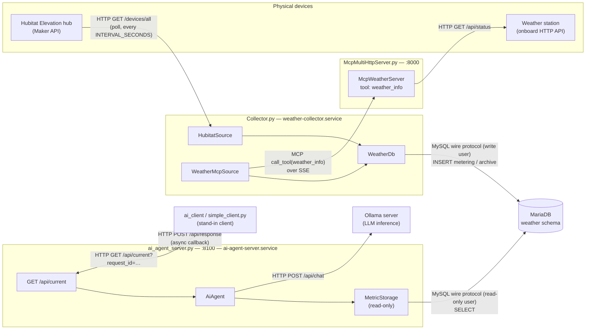

# AI agents

A home sensor-monitoring system: a collector polls Hubitat and a local
weather station on a fixed interval and stores every reading in MariaDB, and
an AI agent layer (backed by Ollama) reasons over that data and answers
requests through an async HTTP API.

## Components

### Collector (`Collector.py`)
The write-side entry point. On a fixed interval (`INTERVAL_SECONDS`) it
polls every `Source` concurrently, writes what comes back through
`WeatherDb`, and once a calendar month rolls over, archives the previous
month's raw readings into hourly averages so `metering` doesn't grow
unbounded. Runs as the `weather-collector` systemd service; `--once` and
`--dry-run` cover a single manual cycle, `--archive-data` runs just the
archiving step.

### Sources (`Source.py`, `Reading.py`, `HubitatSource.py`, `HubitatClient.py`, `WeatherMcpSource.py`)
`Source` is the common shape every upstream is adapted to: `collect()`
returns a flat list of `Reading`s and never raises, so one dead upstream
only costs that cycle's readings from it.

- `HubitatSource` talks to a Hubitat Elevation hub through `HubitatClient`,
  over the hub's local Maker API (plain HTTP, no cloud) - one
  `devices/all` call per cycle covers every paired sensor.
- `WeatherMcpSource` gets the local weather station's readings by calling
  an MCP tool (`weather_info`) rather than reaching the station directly -
  see the MCP server below.

### Weather station MCP server (`McpMultiHttpServer.py`, `McpWeather.py`, `HttpClient.py`)
A small standalone process exposing the physical weather station as an MCP
tool server, so any MCP-speaking client (the collector today, an
Ollama-driven agent later) can query it without knowing the station's own
HTTP API. `McpMultiHttpServer.py` hosts one or more MCP servers behind a
single Starlette/uvicorn port, routed by path (`McpWeatherServer` lives
under `/weather`); `McpWeather.py` implements the `weather_info` tool by
fetching the station's own HTTP status endpoint through `HttpClient.py`
(aiohttp).

### Database (`db/weather.sql`, `db/weather_users.sql.example`, `WeatherDb.py`)
MariaDB schema: `location`, `sensor`, `metric`, `metering` (raw readings),
and `metering_history` (hourly-averaged archive). Two DB users keep write
and read paths separate - `weather` (SELECT/INSERT/UPDATE/DELETE, used by
`WeatherDb`/`Collector.py`) and `weather_read` (SELECT-only, used by the AI
agent's storage layer) - so a bug on the read side can't corrupt data.
User creation lives in the gitignored `db/weather_users.sql`, copied from
the committed `.example`.

### AI agent (`ai_agent.py`, `ai_agent_storage.py`, `OllamaClient.py`)
The reasoning layer. `MetricStorage` (`ai_agent_storage.py`) wraps the
`weather` schema behind read-only queries (`get_current`, `get_stats`,
`get_history`, ...) formatted as compact text for a prompt. `OllamaClient`
wraps one model + one conversation talking to an Ollama server over its
HTTP `/api/chat` endpoint, with disk-persisted history and automatic
sliding-window summarization once a conversation grows past a configured
token budget. `AiAgent` ties the two together behind two models - a small
one for cheap/frequent calls (`summarize_current`,
`summarize_current_battery`) and a large one for anything needing more
reasoning (`transalate_eng_ru`).

### AI agent HTTP API (`ai_agent_server.py`)
Exposes `AiAgent` over HTTP for a client that shouldn't have to hold a
connection open through a model call. A `GET` is answered immediately -
`200` once accepted, `503` if Ollama isn't reachable, `500` if something
else stopped it from starting - and the actual answer is delivered later as
a `POST` back to the client, once the model call finishes. Runs as the
`ai-agent-server` systemd service, on its own port and its own unit so it
restarts independently of the collector.

### AI client (`ai_client/simple_client.py`)
A throwaway stand-in for the real client, until one exists: listens for the
`POST /api/response` callback and prints it, and can fire a
`GET /api/current` with a generated `request_id` on demand. Exists to
exercise the API's accept-then-callback contract end to end.

### Configuration (`Config.py`, `collector.env.example`)
Every component reads a single `Config`, built from the environment
(optionally seeded from a gitignored `.env`) via `Config.from_env()`.
`collector.env.example` documents every variable and its default - DB and
Hubitat credentials have no default and must come from `.env`.

### Deployment (`weather-collector.service`, `ai-agent-server.service`, `docker/`)
Each long-running process gets its own systemd unit, so a crash in one
doesn't take down the other. `docker/` holds a Dockerfile and unpinned
`requirements.txt` for containerized runs.

## Communication diagram

**Protocols in play:**
- **HTTP/REST** - Hubitat's Maker API, the weather station's own status
  endpoint, Ollama's `/api/chat`, and the agent's own client-facing API
  (both the `GET` request and the async `POST` callback).
- **MCP over SSE** - between `WeatherMcpSource` and `McpMultiHttpServer`,
  so the collector never talks to the weather station's HTTP API directly.
- **MySQL wire protocol** - `pymysql` connections from `WeatherDb` (write)
  and `MetricStorage` (read-only) to MariaDB.
