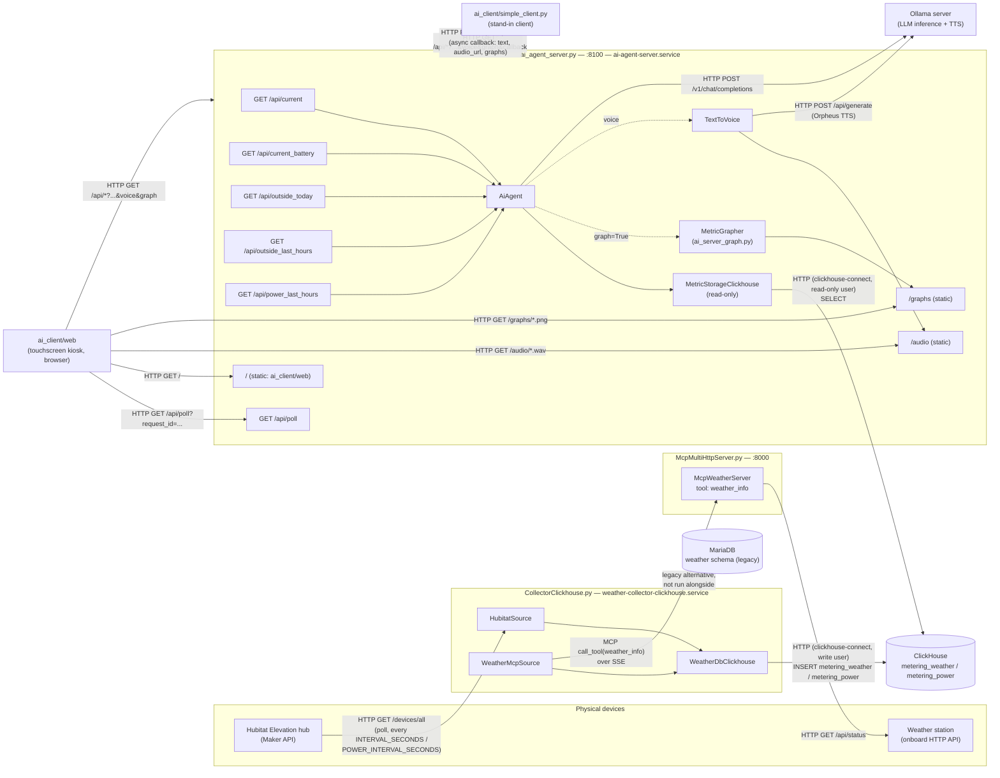

# AI agents

A home sensor-monitoring system: a collector polls Hubitat and a local
weather station on a fixed interval and stores every reading, and an AI
agent layer (backed by Ollama) reasons over that data and answers requests
through an async HTTP API, reachable from a touchscreen web client or any
client speaking its accept-then-callback/poll contract.

The storage layer exists in two generations. `Collector.py` writes to
MariaDB (the original schema, `db/weather.sql`) and is kept only for
continuity; `CollectorClickhouse.py` writes to ClickHouse
(`db/clickhouse/weather_clickhouse.sql`) and is the one actually in service
today - it also samples the `power` metric on its own faster cadence, which
the MariaDB collector never did. `AiAgent` reads exclusively from
ClickHouse (`MetricStorageClickhouse`); the MariaDB read layer
(`ai_agent_storage.MetricStorage`) still exists but is no longer wired into
the agent, only exercised by its own `demo()`.

## Components

### Collectors (`Collector.py`, `CollectorClickhouse.py`)
The write-side entry points - run only one against a given store.

- `Collector.py` (legacy, MariaDB): on a fixed interval (`INTERVAL_SECONDS`)
  polls every `Source` concurrently, writes through `WeatherDb`, and once a
  calendar month rolls over, archives the previous month's raw readings
  into hourly averages so `metering` doesn't grow unbounded. Runs as the
  `weather-collector` systemd service; `--once` and `--dry-run` cover a
  single manual cycle, `--archive-data` runs just the archiving step.
- `CollectorClickhouse.py` (current, ClickHouse): runs two cadences
  concurrently through one `WeatherDbClickhouse` - a weather loop
  (`INTERVAL_SECONDS`, default 600s) storing everything except `power` into
  `metering_weather`, and a power loop (`POWER_INTERVAL_SECONDS`, default
  10s) polling just the power-capable sources (Hubitat) into
  `metering_power`. No archiving loop - ClickHouse's own materialized views
  and TTLs keep rollups and retention current. Runs as the
  `weather-collector-clickhouse` systemd service; `--once`/`--dry-run` work
  the same way.

### Sources (`Source.py`, `Reading.py`, `HubitatSource.py`, `HubitatClient.py`, `WeatherMcpSource.py`)
`Source` is the common shape every upstream is adapted to: `collect()`
returns a flat list of `Reading`s and never raises, so one dead upstream
only costs that cycle's readings from it. `Reading.is_power` flags the
`power` metric, which is how both collectors split readings into the
weather vs. power path (fast cadence + its own table in
`CollectorClickhouse`, hourly-average archiving in `Collector`).

- `HubitatSource` talks to a Hubitat Elevation hub through `HubitatClient`,
  over the hub's local Maker API (plain HTTP, no cloud) - one
  `devices/all` call per cycle covers every paired sensor, power included.
- `WeatherMcpSource` gets the local weather station's readings by calling
  an MCP tool (`weather_info`) rather than reaching the station directly -
  see the MCP server below.

### Weather station MCP server (`McpMultiHttpServer.py`, `McpWeather.py`, `HttpClient.py`)
A small standalone process exposing the physical weather station as an MCP
tool server, so any MCP-speaking client (either collector) can query it
without knowing the station's own HTTP API. `McpMultiHttpServer.py` hosts
one or more MCP servers behind a single Starlette/uvicorn port, routed by
path (`McpWeatherServer` lives under `/weather`); `McpWeather.py`
implements the `weather_info` tool by fetching the station's own HTTP
status endpoint through `HttpClient.py` (aiohttp).

### Database
Two schemas, one per collector generation:

- **MariaDB** (`db/weather.sql`, `db/weather_users.sql.example`,
  `WeatherDb.py`) - `location`, `sensor`, `metric`, `metering` (raw
  readings), `metering_history` (hourly-averaged archive). Two DB users
  keep write and read paths separate - `weather` (used by
  `WeatherDb`/`Collector.py`) and `weather_read` (SELECT-only, used by the
  legacy `MetricStorage`).
- **ClickHouse** (`db/clickhouse/weather_clickhouse.sql`,
  `WeatherDbClickhouse.py`) - the current store. Readings are split by
  metric into `metering_weather` (everything except `power`, ~10-day TTL,
  rolled up hourly into `metering_weather_hourly`) and `metering_power`
  (`power` only, kept at full resolution indefinitely, rolled up daily into
  `metering_power_daily`). Same `weather`/`weather_read` write/read user
  split as MariaDB. `db/clickhouse/export_from_mariadb.sh` and
  `import_to_clickhouse.sh` migrate existing history over one time.

User creation for both lives in gitignored `*_users.sql`/`.env`-adjacent
files, copied from the committed `.example`s.

### AI agent (`ai_agent.py`, `ai_agent_storage_clickhouse.py`, `ai_agent_storage.py`, `OllamaClient.py`)
The reasoning layer. `MetricStorageClickhouse`
(`ai_agent_storage_clickhouse.py`) wraps the ClickHouse `weather` schema
behind the same read-only query shapes `ai_agent_storage.MetricStorage`
(MariaDB) defined - `get_current`, `get_stats`, `get_history`,
`today_outside`, ... - formatted as compact text for a prompt by the
`format_*` helpers, which both storage layers share (imported from
`ai_agent_storage.py` either way). `get_stats`/`get_history` take either
one metric or a list, so several metrics come back from one query instead
of one round trip each. `OllamaClient` wraps one model + one conversation
talking to an OpenAI-compatible `/v1/chat/completions` endpoint - Ollama or
a llama.cpp server, whichever `ollama_url` points at - with disk-persisted
history and automatic sliding-window summarization once a conversation
grows past a configured token budget. `AiAgent` ties the (ClickHouse)
storage layer, two chat models, `TextToVoice` (speech synthesis, see
below) and `MetricGrapher` together - a small model for cheap/frequent
calls (`summarize_current`, `summarize_current_battery`,
`summarize_outside_for_today`, `summarize_history_outside_last_hours`,
`summarize_history_power_last_hours`), a large one for anything needing
more reasoning (`transalate_eng_ru`), and `say()` for turning any answer
into a `.wav`.

### Metric graphs (`ai_server_graph.py`)
Renders a storage-layer result as a PNG into `graph_output_dir` -
`MetricGrapher.plot_metrics()` sniffs which of `get_stats`/`get_history`/
`today_outside`'s shapes it was given and picks a line or bar chart
accordingly. A single-metric `get_history()`-shaped result (one metric,
several locations) becomes one line chart with one line per location -
which is what makes `summarize_history_power_last_hours(graph=True)` a
single graph with every device plotted together, rather than one graph
each. `get_current`-shaped data (a single reading, nothing to plot a trend
from) is rejected. Used by `AiAgent.summarize_outside_for_today`/
`summarize_history_outside_last_hours`/`summarize_history_power_last_hours`
when called with `graph=True`.

### AI agent HTTP API (`ai_agent_server.py`)
Exposes `AiAgent` over HTTP for a client that shouldn't have to hold a
connection open through a model call. A `GET` is answered immediately -
`200` once accepted, `503` if Ollama isn't reachable, `500` if something
else stopped it from starting - and the actual answer follows later,
delivered either or both of two ways: a `POST /api/response` callback to
`config.ai_client_callback_url` (only if the request asked for it with
`&callback`), and/or `GET /api/poll[?request_id=<id>]`, which reports on
the single most recently accepted request - the only option for a client
with no listening socket of its own, like a browser page.

Endpoints, all following that same accept-then-deliver shape:

| Endpoint | Summarizes |
| --- | --- |
| `GET /api/current` | Latest reading per location/metric |
| `GET /api/current_battery` | Devices below the low-battery threshold |
| `GET /api/outside_today` | Today's outside temperature+humidity (08:00-21:00 or now) |
| `GET /api/outside_last_hours[?hours=<n>]` | Outside temperature+humidity, last `hours` (default 24) |
| `GET /api/power_last_hours[?hours=<n>]` | Power usage per device, last `hours` (default 24) |

Any of them takes `&voice[=<name>]` for a spoken answer; the last three
also take `&graph` for a rendered PNG (one per metric, except
`power_last_hours`, which has one metric split across devices and so
always comes back with at most one). Synthesized `.wav`s and rendered
`.png`s are served back over HTTP from `/audio` and `/graphs`, and linked
in the response as `audio_url`/`graphs`. The touchscreen web client
(below) is also served by this same process, mounted at `/` - same origin
as the API, so the browser needs no CORS configuration to reach it. Runs
as the `ai-agent-server` systemd service, on its own port and its own unit
so it restarts independently of either collector.

### AI clients (`ai_client/`)
- **`ai_client/web/`** - the real client: a static HTML/CSS/JS touchscreen
  kiosk UI sized for a 1024x600 screen (`client_spec.txt` is the spec,
  `screen_layout.png` the mockup). Buttons for the parameterless and
  parameterized requests, Audio/Graph toggle switches (persisted to
  `localStorage` across restarts, along with the last-hours selection), a
  metric picker for multi-graph responses, and a "Thinking... m:ss"
  status. Since a browser page can't accept the `POST /api/response`
  callback, it drives everything through `GET /api/poll` instead, with its
  own client-side timeout independent of server-side processing time.
- **`ai_client/simple_client.py`** - a throwaway stand-in kept only until
  the web client fully replaces it: listens for the callback and prints
  it, and prints a numbered menu of the agent's endpoints so any of them
  can be fired on demand, with `--voice`/`--graph` opting into those
  extras where the endpoint supports them.

### Configuration (`Config.py`, `collector.env.example`)
Every component reads a single `Config`, built from the environment
(optionally seeded from a gitignored `.env`) via `Config.from_env()`.
`collector.env.example` documents every variable and its default -
MariaDB (`DB_*`), ClickHouse (`CH_*`), and Hubitat credentials have no
default and must come from `.env`.

### Deployment (`weather-collector.service`, `weather-collector-clickhouse.service`, `ai-agent-server.service`, `docker/`)
Each long-running process gets its own systemd unit, so a crash in one
doesn't take down the others - run only one of the two collector units
against a given store. `docker/` holds Dockerfiles (CPU and GPU variants)
and `requirements*.txt` for containerized runs.

## Communication diagram

```mermaid
flowchart LR
    subgraph Hardware["Physical devices"]
        Hub["Hubitat Elevation hub<br/>(Maker API)"]
        Station["Weather station<br/>(onboard HTTP API)"]
    end

    subgraph ChCollectorProc["CollectorClickhouse.py — weather-collector-clickhouse.service"]
        direction TB
        HubSrcCh["HubitatSource"]
        WxSrcCh["WeatherMcpSource"]
        WDbCh["WeatherDbClickhouse"]
        HubSrcCh --> WDbCh
        WxSrcCh --> WDbCh
    end

    subgraph McpProc["McpMultiHttpServer.py — :8000"]
        McpWx["McpWeatherServer<br/>tool: weather_info"]
    end

    CH[("ClickHouse<br/>metering_weather / metering_power")]
    MariaDB[("MariaDB<br/>weather schema (legacy)")]

    subgraph AgentProc["ai_agent_server.py — :8100 — ai-agent-server.service"]
        direction TB
        ApiCurrent["GET /api/current"]
        ApiBattery["GET /api/current_battery"]
        ApiToday["GET /api/outside_today"]
        ApiLastHours["GET /api/outside_last_hours"]
        ApiPower["GET /api/power_last_hours"]
        ApiPoll["GET /api/poll"]
        Agent["AiAgent"]
        Store["MetricStorageClickhouse<br/>(read-only)"]
        Grapher["MetricGrapher<br/>(ai_server_graph.py)"]
        Voice["TextToVoice"]
        Audio["/audio (static)"]
        Graphs["/graphs (static)"]
        WebStatic["/ (static: ai_client/web)"]
        ApiCurrent --> Agent
        ApiBattery --> Agent
        ApiToday --> Agent
        ApiLastHours --> Agent
        ApiPower --> Agent
        Agent --> Store
        Agent -. "graph=True" .-> Grapher
        Agent -. "voice" .-> Voice
        Grapher --> Graphs
        Voice --> Audio
    end

    Ollama["Ollama server<br/>(LLM inference + TTS)"]
    WebClient["ai_client/web<br/>(touchscreen kiosk, browser)"]
    SimpleClient["ai_client/simple_client.py<br/>(stand-in client)"]

    Hub -- "HTTP GET /devices/all\n(poll, every INTERVAL_SECONDS /\nPOWER_INTERVAL_SECONDS)" --> HubSrcCh
    WxSrcCh -- "MCP call_tool(weather_info)\nover SSE" --> McpWx
    McpWx -- "HTTP GET /api/status" --> Station
    WDbCh -- "HTTP (clickhouse-connect, write user)\nINSERT metering_weather / metering_power" --> CH

    Store -- "HTTP (clickhouse-connect, read-only user)\nSELECT" --> CH
    Agent -- "HTTP POST /v1/chat/completions" --> Ollama
    Voice -- "HTTP POST /api/generate\n(Orpheus TTS)" --> Ollama

    WebClient -- "HTTP GET /api/*?...&voice&graph" --> AgentProc
    WebClient -- "HTTP GET /api/poll?request_id=..." --> ApiPoll
    WebClient -- "HTTP GET /" --> WebStatic
    SimpleClient -- "HTTP GET /api/*?...&voice&graph&callback" --> AgentProc
    AgentProc -. "HTTP POST /api/response\n(async callback: text, audio_url, graphs)" .-> SimpleClient
    WebClient -- "HTTP GET /audio/*.wav" --> Audio
    WebClient -- "HTTP GET /graphs/*.png" --> Graphs

    ChCollectorProc -.->|"legacy alternative,\nnot run alongside"| MariaDB
```

**Protocols in play:**
- **HTTP/REST** - Hubitat's Maker API, the weather station's own status
  endpoint, ClickHouse's HTTP interface (`clickhouse-connect`), Ollama's
  `/v1/chat/completions` and `/api/generate`, the agent's own
  client-facing API (`GET` requests, the async `POST` callback, and
  `GET /api/poll`), and the static `/audio`/`/graphs`/`/` mounts the
  responses' links point at.
- **MCP over SSE** - between `WeatherMcpSource` and `McpMultiHttpServer`,
  so the collector never talks to the weather station's HTTP API directly.
- **MySQL wire protocol** - `pymysql` connections from the legacy
  `WeatherDb`/`MetricStorage` to MariaDB, only if that collector variant is
  in use.
